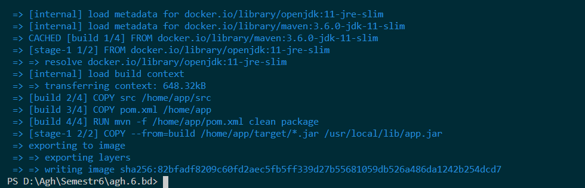
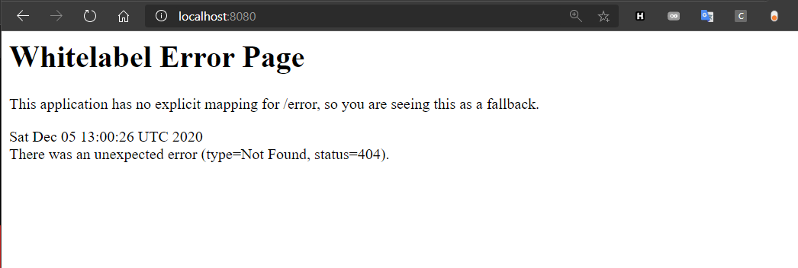
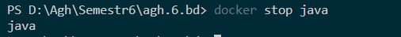
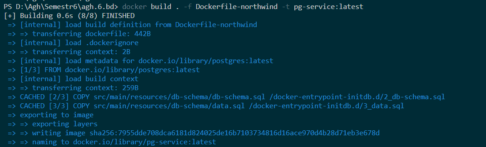
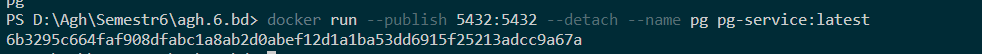
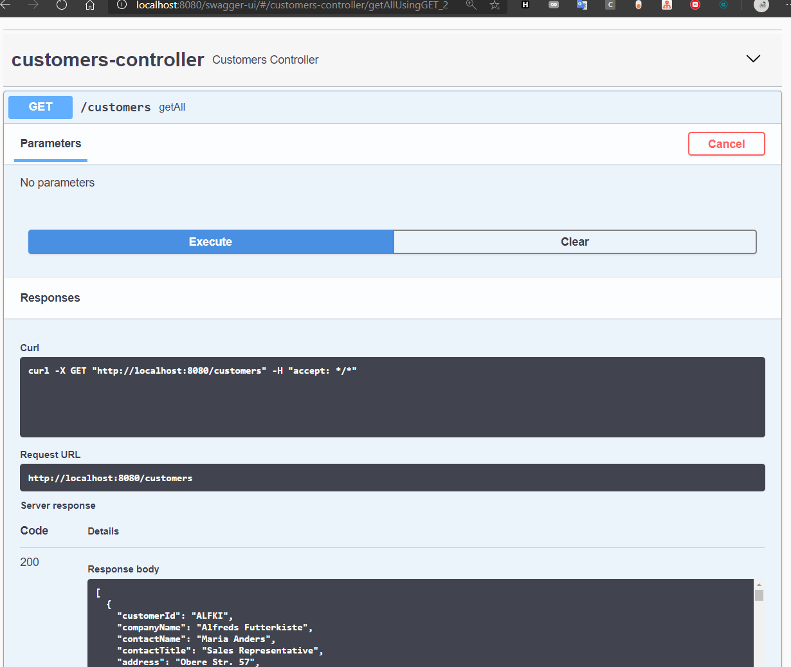
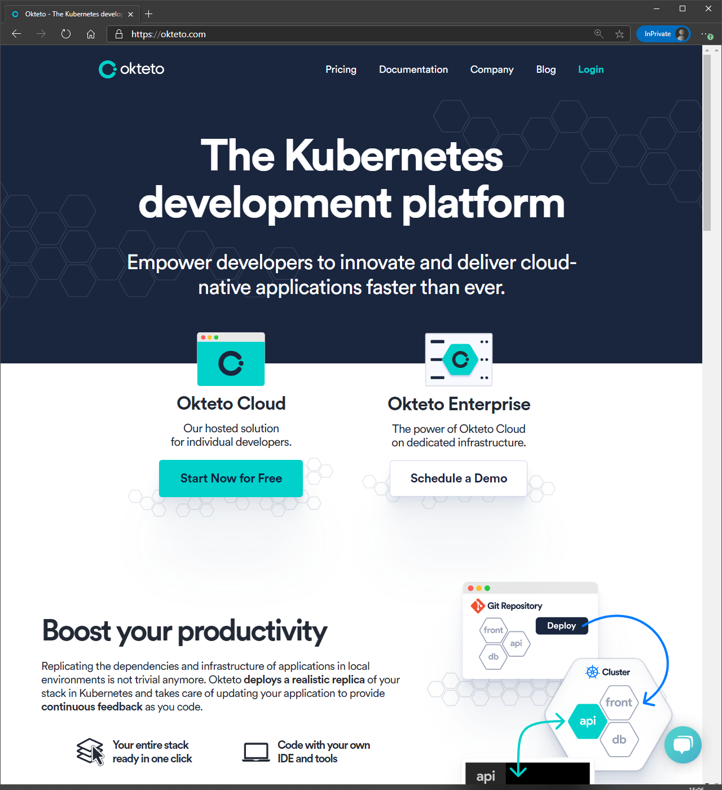
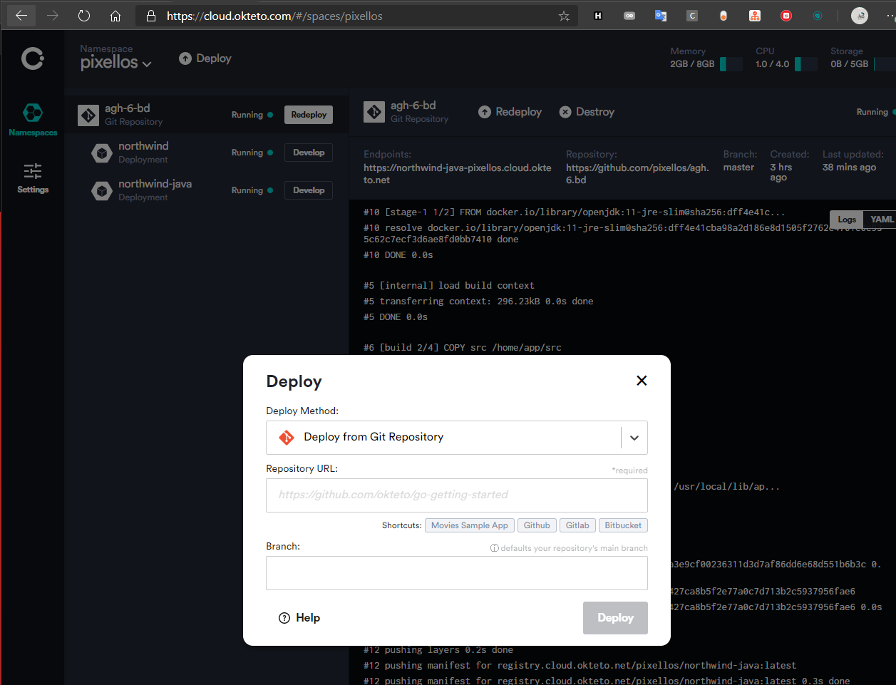
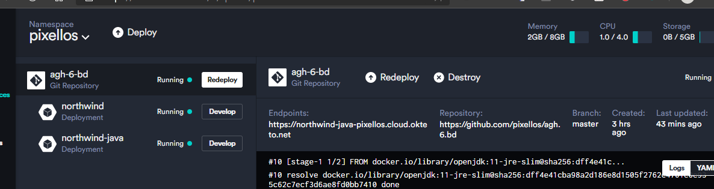

- [Docker](#docker)
- [Prerekwizyty](#prerekwizyty)
  - [Java](#java)
    - [Dockerfile](#dockerfile)
    - [Budowanie](#budowanie)
    - [Uruchamianie](#uruchamianie)
  - [PostGres](#postgres)
    - [Dockerfile](#dockerfile-1)
    - [Budowanie](#budowanie-1)
    - [Uruchamianie](#uruchamianie-1)
  - [Komunikacja pomiędzy kontenerami `docker-compose`](#komunikacja-pomiędzy-kontenerami-docker-compose)
  - [Deploy używając Okteto-stacks](#deploy-używając-okteto-stacks)

# Docker
*Co chcemy osiągnąć w tej sekcji?*
 
Zbudować aplikację Java korzystającą z bazy danych

# Prerekwizyty
[https://docs.microsoft.com/en-us/windows/wsl/install-win10]()

[https://docs.docker.com/docker-for-windows/install/]()

## Java

Będziemy korzystać z `Maven` 

W katalogu `src\` znajdują się pliki projektu Java

Mając plik `pom.xml` w root solucji i korzystając z odpowiedzi `https://stackoverflow.com/a/27768965/5381370` możemy w root solucji stworzyć `Dockerfile`, który będzie służył za postawę do postawienia naszej aplikacji

### Dockerfile

*./Dockerfile*
```dockerfile
FROM maven:3.6.0-jdk-11-slim AS build
COPY src /home/app/src
COPY pom.xml /home/app
RUN mvn -f /home/app/pom.xml clean package

FROM openjdk:11-jre-slim
COPY --from=build /home/app/target/*.jar /usr/local/lib/app.jar
EXPOSE 8080
ENTRYPOINT ["java","-jar","/usr/local/lib/app.jar"]
```

### Budowanie


Możemy sprawdzić, czy obraz się poprawnie buduje

Switch `t` służy do nazwania obrazu 

`docker build . -t java-service:latest`

Po kilku minutach budowanie powinno zakończyć się bez błędu 



### Uruchamianie 

Wtedy możemy uruchomić nasz obraz

`docker run --publish 8080:8080 --detach --name java java-service:latest`

i w przeglądarce powinniśmy dać rady  połączyć się z aplikacją



możemy go zatrzymać wywołując `docker stop java`



Ale w dalszym ciągu nie mamy bazy

## PostGres
Do PostGres istnieje gotowy obraz, rozszerzmy go

### Dockerfile

*./Dockerfile*
```dockerfile
# Jako base używamy oficjalnego obrazu postgres
FROM postgres:latest

# Wszystkie pliki skopiowane do `/docker-entrypoint-initdb.d/` są wywoływane gdy nie ma bazy
COPY src/main/resources/db-schema/db-schema.sql /docker-entrypoint-initdb.d/2_db-schema.sql
COPY src/main/resources/db-schema/data.sql /docker-entrypoint-initdb.d/3_data.sql

ENV POSTGRES_HOST_AUTH_METHOD=trust
ENV POSTGRES_PASSWORD=postgres
ENV POSTGRES_DB=northwind
ENV POSTGRES_USER=postgres

# Komendy, które udają orginalny obraz

ENTRYPOINT ["docker-entrypoint.sh"]
EXPOSE 5432
CMD ["postgres"]
```

### Budowanie

`docker build . -f Dockerfile-northwind -t pg-service:latest`




### Uruchamianie

`docker run --publish 5432:5432 --detach --name pg pg-service:latest`




## Komunikacja pomiędzy kontenerami `docker-compose`

Jako, że Docker nie ma domyślnie żadnego wbudowanego sposobu na łączność pomiędzy kontenerami użyjemy `docker-compose`

*docker-compose.yaml*
```yaml
version: '3.1'
services:
  northwind:
    build: 
      context: .
      dockerfile: Dockerfile-northwind
    ports:
      - 5432:5432
    networks:
      - postgres
    volumes:
      - database-data2:/var/lib/postgresql/data/ # persist data even if container shuts down

  northwind-java:
    depends_on:
       - northwind
    build: 
      context: .
      dockerfile: Dockerfile
    ports:
      - 8080:8080
    networks:
      - postgres

volumes:
  database-data2: 

networks:
  postgres:
    driver: bridge
```

Ustawiliśmy sobie most sieciowy przez który połączymy sobie aplikacje

```yaml
networks:
  postgres:
    driver: bridge
```

w każdym Dockerfile

```yaml
 networks:
      - postgres
```

oraz wykorzystujemy poprzednio stworzone `dockerfile`

```yaml
build: 
  context: .
  dockerfile: Dockerfile
```

po wywołaniu 
```powershell
& docker-compose build
& docker-compose up
```

Nasza baza i aplikacja powinny się uruchomić, i powinniśmy być w stanie otworzyć 
[http://localhost:8080]()


*swagger ui z danymi*

## Deploy używając Okteto-stacks

Naszą konstelacje aplikacji możemy zdeployować za darmo używając Okteto


[https://okteto.com/]()

Robimy konto, polecam przez githuba

Gdy potwierdzimy mail dodajemy nasze repo



I teraz możemy przejść do konfiguracji

W repo  solucji tworzymy plik `okteto-stack.yml` i odwzorowujemy naszego `docker-compse`

```
name: myapp
services:
  northwind:
    environment:
      - POSTGRES_HOST_AUTH_METHOD=trust
    image: okteto.dev/northwind
    build:
      context: .
      dockerfile: Dockerfile-northwind
    ports:
      - 5432

  northwind-java:
    public: true
    image: okteto.dev/northwind-java
    build: .
    ports:
      - 8080

```

Klikamy `redeploy`



I możemy używać naszej aplikacji 

https://northwind-java-pixellos.cloud.okteto.net/swagger-ui/