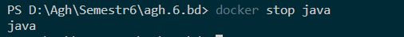
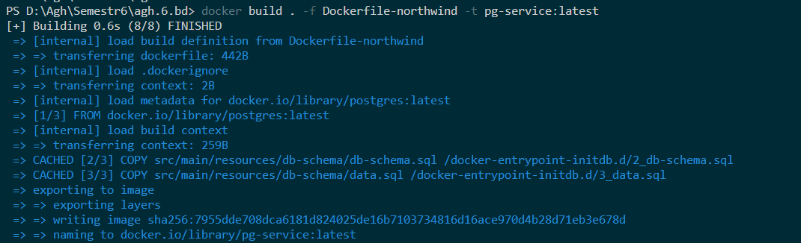
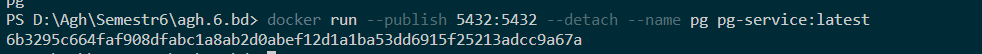
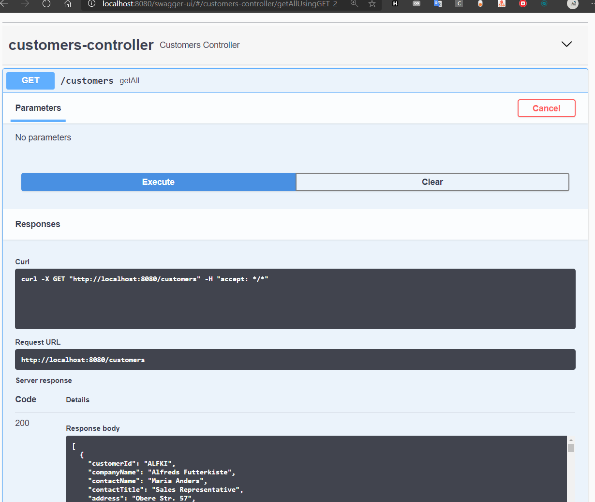

- [Docker](#docker)
- [Install it first](#install-it-first)
  - [Java Configuration](#java-configuration)
    - [Dockerfile](#dockerfile)
    - [Building](#building)
    - [Running](#running)
  - [PostGres](#postgres)
    - [Dockerfile](#dockerfile-1)
    - [Building](#building-1)
    - [Running](#running-1)
  - [Communication between containers - introducing `docker-compose`](#communication-between-containers---introducing-docker-compose)
    - [Running](#running-2)
  - [Deploy by Okteto-stacks](#deploy-by-okteto-stacks)

# Docker
*Pss, buddy, want a candy?*
 
# Install it first
[https://docs.microsoft.com/en-us/windows/wsl/install-win10]()

[https://docs.docker.com/docker-for-windows/install/]()

## Java Configuration

We gonna use `Maven` 

Under `src\` we can place java files

Given `pom.xml` in solution root basing on `https://stackoverflow.com/a/27768965/5381370` we can create `Dockerfile`, which we will be using as a recipe how to set up application

### Dockerfile

*./Dockerfile*
```dockerfile
FROM maven:3.6.0-jdk-11-slim AS build
COPY src /home/app/src
COPY pom.xml /home/app
RUN mvn -f /home/app/pom.xml clean package

FROM openjdk:11-jre-slim
COPY --from=build /home/app/target/*.jar /usr/local/lib/app.jar
EXPOSE 8080
ENTRYPOINT ["java","-jar","/usr/local/lib/app.jar"]
```

### Building

Now we can check if project is building correctly

`docker build . -t java-service:latest`

`.` - we gonna use current working directory as a context, so make sure its same that one which contains dockerfile

After few mins we should have build docker image


### Running 

Finally! We can run our image now.

`docker run --publish 8080:8080 --detach --name java java-service:latest`

`--publish 8080:8080` - we're redirecting container port 8080 to host 8080
`--detach` - do not use current console 

When that one runs successfully we should be able to connect to app


Okay, all right, now we can stop that using `docker stop java`



But we don't have any DB yet :O

## PostGres

Postgres does have existing image, so we can just use it

But to make things a little more complicated, and to use custom init script which would set up db we do a little magic ;)

### Dockerfile

*./Dockerfile*
```dockerfile
# Use official postgress image
FROM postgres:latest

# All files from `/docker-entrypoint-initdb.d/` are executed if DB is not initialized
COPY src/main/resources/db-schema/db-schema.sql /docker-entrypoint-initdb.d/2_db-schema.sql
COPY src/main/resources/db-schema/data.sql /docker-entrypoint-initdb.d/3_data.sql

ENV POSTGRES_HOST_AUTH_METHOD=trust
ENV POSTGRES_PASSWORD=postgres
ENV POSTGRES_DB=northwind
ENV POSTGRES_USER=postgres

# Reusing entrypoint, expose, cmd from original image

ENTRYPOINT ["docker-entrypoint.sh"]
EXPOSE 5432
CMD ["postgres"]
```

### Building

`docker build . -f Dockerfile-northwind -t pg-service:latest`

`-f` switch is used when we have multiple `Dockerfiles` in dir and we want to use one



### Running

`docker run --publish 5432:5432 --detach --name pg pg-service:latest`




## Communication between containers - introducing `docker-compose`

Docker by its own does not have any build-in way to setup constelation of containers - we gonna use  `docker-compose` to deal with that

*docker-compose.yaml*
```yaml
version: '3.1'
services:
  northwind:
    build: 
      context: .
      dockerfile: Dockerfile-northwind
    ports:
      - 5432:5432
    networks:
      - postgres
    volumes:
      - database-data2:/var/lib/postgresql/data/ # persist data even if container shuts down

  northwind-java:
    depends_on:
       - northwind
    build: 
      context: .
      dockerfile: Dockerfile
    ports:
      - 8080:8080
    networks:
      - postgres

volumes:
  database-data2: 

networks:
  postgres:
    driver: bridge
```

We need to setup networks to enable communication between containers

```yaml
networks:
  postgres:
    driver: bridge
```

In each service we need to add 

```yaml
 networks:
      - postgres
```

Also, we're using `dockerfile` that was created before

```yaml
build: 
  context: .
  dockerfile: Dockerfile
```

### Running

We can execute 

```powershell
& docker-compose build
& docker-compose up
```

After that DB and app should be up and running 

[http://localhost:8080]()


*Swagger ui with data*

## Deploy by Okteto-stacks

To get everything in cloud we can use free Okteto-stacks service


[https://okteto.com/]()

First, we need an account - i tried github login, went smooth

After mail confirmation we need to add permissions to repo


And we can continue

In git root we need to add file `okteto-stack.yml` and we need to replicated `docker-compse` with new syntax

```
name: myapp
services:
  northwind:
    environment:
      - POSTGRES_HOST_AUTH_METHOD=trust
    image: okteto.dev/northwind
    build:
      context: .
      dockerfile: Dockerfile-northwind
    ports:
      - 5432

  northwind-java:
    public: true
    image: okteto.dev/northwind-java
    build: .
    ports:
      - 8080

```

Last thing is clicking `redeploy`


And we can use our app

https://northwind-java-pixellos.cloud.okteto.net/swagger-ui/