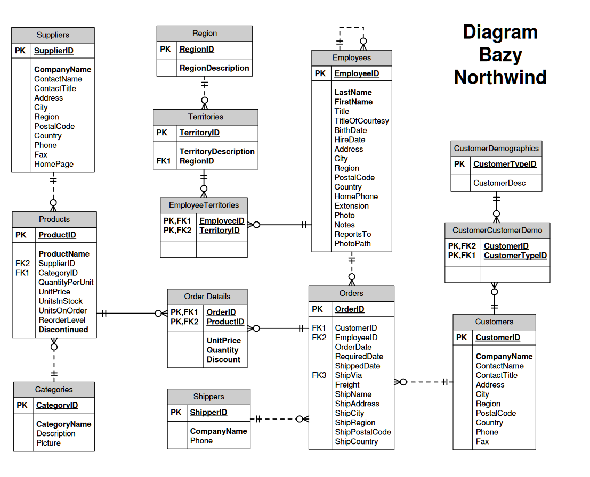
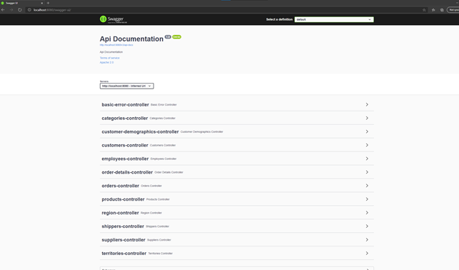
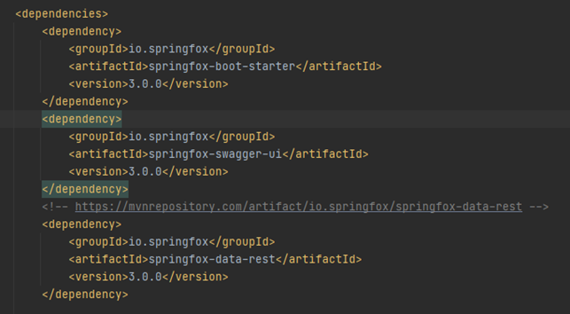

## Akademia Górniczo-Hutnicza im. Stanisława Staszica w Krakowie

Wydział Informatyki, Elektroniki i Telekomunikacji


# Bazy danych – Northwind



# System do składania zamówień

Autorzy
- Kamil Gliński
- Mateusz Popielarz
- Michał Flak

# Spis treści
- [Bazy danych – Northwind](#bazy-danych--northwind)
- [System do składania zamówień](#system-do-składania-zamówień)
- [Spis treści](#spis-treści)
- [Wstęp](#wstęp)
  - [Przebieg prac:](#przebieg-prac)
  - [Adres do repozytorium:](#adres-do-repozytorium)
    - [Użyte technologie:](#użyte-technologie)
    - [Uzasadnienie:](#uzasadnienie)
  - [Uruchomienie dla developera:](#uruchomienie-dla-developera)
  - [Uruchomienie:](#uruchomienie)
  - [Odnośniki w aplikacji](#odnośniki-w-aplikacji)
- [Dokumentacja funkcjonalna](#dokumentacja-funkcjonalna)
  - [Interfejs użytkownika](#interfejs-użytkownika)
    - [Konfiguracja](#konfiguracja)
    - [Dodać paczki](#dodać-paczki)
      - [Skonfigurować middleware](#skonfigurować-middleware)
  - [Część backendowa - bottom up](#część-backendowa---bottom-up)
  - [Mapowanie obiektowo - relacyjne](#mapowanie-obiektowo---relacyjne)
  - [Część biznesowo - aplikacyjna](#część-biznesowo---aplikacyjna)
  - [Przykładowe wywołania na produkcie:](#przykładowe-wywołania-na-produkcie)
    - [1. GetAll](#1-getall)
    - [2. GetAllByCategory](#2-getallbycategory)
    - [3. Create](#3-create)
    - [](#)
  - [Encje z rozbudowanym CRUD-em](#encje-z-rozbudowanym-crud-em)
# Wstęp

## Przebieg prac:

Do synchronizowania efektów pracy używamy oprogramowania GIT i serwisu GitHub

## Adres do repozytorium:

https://github.com/pixellos/agh.6.bd

### Użyte technologie:

- PostgreSql,
- Hibernate,
- Java,
- Spring boot
- Swagger
- SwaggerUI

### Uzasadnienie:

(tutaj parę słów żeby wyjaśnić czemu to wybraliście)

## Uruchomienie dla developera:

W celu uruchomienia aplikacji należy:
- Sklonować repozytorium,
- Zainstalować na lokalnym komputerze bazę danych PostgreSql
- Wykonać na bazie danych skrypty które znajdują się w repozytorium w lokalizacji /resources/db-schema
- Uruchomić aplikacje backendową przez klasę NorthwindApplication.java

## Uruchomienie:

W celu uruchomienia aplikacji należy zainstalować:
- Docker for Windows
- WSL2

Wykonujemy `initialize.ps1` i aplikacja działa na

[http://localhost:5000]()

jest też hostowana

[https://northwind-java-pixellos.cloud.okteto.net/swagger-ui/]()


## Odnośniki w aplikacji

- pobranie produktow po kategorii 

[http://localhost:8080/products/category/Beverages](http://localhost:8080/products/category/Beverages)

- pobranie produktow po kraju zapewniajacego

[http://localhost:8080/products/supplier/country/USA](http://localhost:8080/products/supplier/country/USA)

[http://localhost:8080/products/supplier/country/Japan](http://localhost:8080/products/supplier/country/Japan)

- pobranie produktow po zapewniajacym

[http://localhost:8080/products/supplierId/1](http://localhost:8080/products/supplierId/1)

- pobranie produktow po id klienta

[http://localhost:8080/orders/customer/SUPRD](http://localhost:8080/orders/customer/SUPRD)

- poranie zamowien po id klienta

[http://localhost:8080/orders/customer/VINET](http://localhost:8080/orders/customer/VINET)

- pobranie zamowien po id klienta

[http://localhost:8080/orders/employee/2](http://localhost:8080/orders/employee/2)

- pobranie pracownikow po id

[http://localhost:8080/employees/2](http://localhost:8080/employees/2)

- pobranie detale zamowien po id zamowienia

[http://localhost:8080/orderDetails/order/10248](http://localhost:8080/orderDetails/order/10248)

- pobranie detali zamowien po id produku

[http://localhost:8080/orderDetails/product/11](http://localhost:8080/orderDetails/product/11)

- pobranie detali zamowien w kategorii produktow

[http://localhost:8080/orderDetails/product/category/Beverages](http://localhost:8080/orderDetails/product/category/Beverages)

- pobranie detali zamowien po id zapewniajacego produkt

[http://localhost:8080/orderDetails/product/supplier/1](http://localhost:8080/orderDetails/product/supplier/1)

- pobranie zamowien po id spedytora

[http://localhost:8080/orders/shipper/1](http://localhost:8080/orders/shipper/1)


# Dokumentacja funkcjonalna

## Interfejs użytkownika

Podstawowym interfejsem użytkownika jest Swagger UI, który pozwala na łatwy dostęp do endpointów aplikacji z poziomu przeglądarki



Rysunek X. Swagger UI W aplikacji

### Konfiguracja

Aby go skonfigurować trzeba: 

###

### Dodać paczki



Rysunek X. Zrzut ekranu z paczkami

#### Skonfigurować middleware
```java
package com.agh;

import org.springframework.boot.SpringApplication;
import org.springframework.boot.autoconfigure.SpringBootApplication;
import org.springframework.context.annotation.Bean;
import org.springframework.context.annotation.Configuration;
import org.springframework.context.annotation.Import;
import org.springframework.web.servlet.view.InternalResourceViewResolver;
import springfox.documentation.spring.data.rest.configuration.SpringDataRestConfiguration;
import springfox.documentation.swagger2.annotations.EnableSwagger2;

@SpringBootApplication
@EnableSwagger2
@Configuration
@Import(SpringDataRestConfiguration.class)
public class NorthwindApplication {

  @Bean
  public InternalResourceViewResolver defaultViewResolver() {
    return new InternalResourceViewResolver();
  }

  public static void main(String[] args) {
    SpringApplication._run_(NorthwindApplication.class, args);
  }
 }
```

Rysunek X. Konfiguracja middleware

Trzeba zwrócić uwagę na linię

```
@Bean
public InternalResourceViewResolver defaultViewResolver() {
  return new InternalResourceViewResolver();
}
```
Rysunek 4. Konfiguracja ViewResolvera

W obecnej wersji w swaggerUI występuje błąd, przez który ViewResolver działa niepoprawnie z najnowszym springiem. Rozwiązaniem jest ustawienie defaultViewResolvera na właściwy typ.

## Część backendowa - bottom up

Odtąd przedstawiona będzie konstrukcja backendu, zaczynając od warstwy dostępu do danych, kończąc na warstwie interfejsu ze światem oraz na przykładowych wywołaniach wraz z generowanym SQL-em.

## Mapowanie obiektowo - relacyjne

W tym celu użyliśmy Hibernate'a. Konfiguracja w pliku `DatabaseConfig`:

```java
@Configuration
@ComponentScan(basePackages = "com.agh")
public class DatabaseConfig {

    @Bean
    public LocalSessionFactoryBean hibernateSessionFactory() {
        LocalSessionFactoryBean sessionFactory = new LocalSessionFactoryBean();
        sessionFactory.setDataSource(dataSource());
        sessionFactory.setPackagesToScan("com.agh");
        sessionFactory.setHibernateProperties(hibernateProperties());
        return sessionFactory;
    }

    @Bean
    public DataSource dataSource() {
        DriverManagerDataSource dataSource = new DriverManagerDataSource();
        dataSource.setDriverClassName("org.postgresql.Driver");
        dataSource.setUrl("jdbc:postgresql://northwind:5432/northwind");
        dataSource.setUsername("postgres");
        dataSource.setPassword("postgres");
        return dataSource;
    }

    private Properties hibernateProperties() {
        Properties properties = new Properties();
        properties.put("hibernate.dialect", "org.hibernate.dialect.PostgreSQLDialect");
        properties.put("hibernate.show_sql", "true");
        properties.put("hibernate.format_sql", "true");
        return properties;
    }
}
```


 Encje zostały zamodelowane jako klasy Java odpowiadające tabelom bazy Northwind, wraz ze związkami między nimi. Przykładowo Products:

```java
@Entity
@Table(name = "products")
public class Products {

    @Id
    @Column(name = "product_id")
    @SequenceGenerator(name = "productSEQ", sequenceName = "product_id_seq", allocationSize = 1)
    @GeneratedValue(strategy = GenerationType.SEQUENCE, generator = "productSEQ")
    private short productId;
    @Column(name = "product_name")
    private String productName;
    @Column(name = "quantity_per_unit")
    private String quantityPerUnit;
    @Column(name = "unit_price")
    private BigDecimal unitPrice;
    @Column(name = "units_in_stock")
    private Short unitsInStock;
    @Column(name = "units_on_order")
    private Short unitsOnOrder;
    @Column(name = "reorder_level")
    private Short reorderLevel;
    @Column(name = "discontinued")
    private int discontinued;

    @ManyToOne
    @JoinColumn(name = "supplier_id", referencedColumnName = "supplier_id")
    private Suppliers suppliers;

    @ManyToOne
    @JoinColumn(name = "category_id", referencedColumnName = "category_id")
    private Categories categories;

    public Products() {
    }


    public short getProductId() {
        return productId;
    }

    public void setProductId(short productId) {
        this.productId = productId;
    }

    public String getProductName() {
        return productName;
    }

    public void setProductName(String productName) {
        this.productName = productName;
    }

    public String getQuantityPerUnit() {
        return quantityPerUnit;
    }

    public void setQuantityPerUnit(String quantityPerUnit) {
        this.quantityPerUnit = quantityPerUnit;
    }

    public BigDecimal getUnitPrice() {
        return unitPrice;
    }

    public void setUnitPrice(BigDecimal unitPrice) {
        this.unitPrice = unitPrice;
    }

    public Short getUnitsInStock() {
        return unitsInStock;
    }

    public void setUnitsInStock(Short unitsInStock) {
        this.unitsInStock = unitsInStock;
    }

    public Short getUnitsOnOrder() {
        return unitsOnOrder;
    }

    public void setUnitsOnOrder(Short unitsOnOrder) {
        this.unitsOnOrder = unitsOnOrder;
    }

    public Short getReorderLevel() {
        return reorderLevel;
    }

    public void setReorderLevel(Short reorderLevel) {
        this.reorderLevel = reorderLevel;
    }

    public int getDiscontinued() {
        return discontinued;
    }

    public void setDiscontinued(int discontinued) {
        this.discontinued = discontinued;
    }

    public Suppliers getSuppliers() {
        return suppliers;
    }

    public void setSuppliers(Suppliers suppliers) {
        this.suppliers = suppliers;
    }

    public Categories getCategories() {
        return categories;
    }

    public void setCategories(Categories categories) {
        this.categories = categories;
    }
}
```

Do zapisywania / odczytywania danych użyliśmy wzorca Repository, żeby zenkapsulować szczegóły implementacji. `AbstractRepository` prezentuje się następująco:

```java
import org.hibernate.Session;
import org.hibernate.SessionFactory;
import org.springframework.beans.factory.annotation.Autowired;

public abstract class AbstractRepository {

    @Autowired
    private SessionFactory sessionFactory;

    protected Session getSession() {
        return sessionFactory.getCurrentSession();
    }

    protected Session getOpenSession() {
        return sessionFactory.openSession();
    }

}
```

A przykładowe repozytorium dla produktów:

```java
@Repository
public class ProductsRepository extends AbstractRepository {

    public List<Products> getAll() {
        Session session = getOpenSession();
        Transaction transaction = session.beginTransaction();
        List<Products> products = session
                .createQuery("SELECT p FROM Products p" +
                        " INNER JOIN FETCH p.suppliers s" +
                        " INNER JOIN FETCH p.categories c", Products.class)
                .list();
        transaction.commit();
        session.close();
        return products;
    }

    public Optional<Products> getById(Short productId) {
        Session session = getOpenSession();
        Transaction transaction = session.beginTransaction();
        Optional<Products> product = session
                .createQuery("SELECT p FROM Products p WHERE p.productId=:productId", Products.class)
                .setParameter("productId", productId)
                .uniqueResultOptional();
        transaction.commit();
        session.close();
        return product;
    }

    public List<Products> getAllByCategory(String categoryName) {
        Session session = getOpenSession();
        Transaction transaction = session.beginTransaction();

        List<Products> products = session.createQuery(
                "SELECT p FROM Products p" +
                        " INNER JOIN FETCH p.suppliers s" +
                        " INNER JOIN FETCH p.categories c" +
                        " WHERE c.categoryName=:categoryName", Products.class)
                .setParameter("categoryName", categoryName)
                .list();

        transaction.commit();
        session.close();
        return products;
    }

    public List<Products> getAllBySupplierId(Short supplierId) {
        Session session = getOpenSession();
        Transaction transaction = session.beginTransaction();

        List<Products> products = session.createQuery(
                "SELECT p FROM Products p" +
                        " INNER JOIN FETCH p.suppliers s" +
                        " INNER JOIN FETCH p.categories c" +
                        " WHERE s.supplierId=:supplierId", Products.class)
                .setParameter("supplierId", supplierId)
                .list();

        transaction.commit();
        session.close();
        return products;
    }

    public List<Products> getAllBySuppliersCountry(String suppliersCountry) {
        Session session = getOpenSession();
        Transaction transaction = session.beginTransaction();

        List<Products> products = session.createQuery(
                "SELECT p FROM Products p" +
                        " INNER JOIN FETCH p.suppliers s " +
                        " INNER JOIN FETCH p.categories c" +
                        " WHERE s.country=:suppliersCountry", Products.class)
                .setParameter("suppliersCountry", suppliersCountry)
                .list();

        transaction.commit();
        session.close();
        return products;
    }

    public void persist(Products product) {
        Session session = getOpenSession();
        Transaction transaction = session.beginTransaction();
        session.persist(product);
        transaction.commit();
        session.close();
    }
}
```

Można zauważyć tu kilka rzeczy:

- Metody `get...` korzystają z napisanych ręcznie kwerend, żeby uniknąć problemu n+1 zapytań
- Zgodnie z sugestią prowadzącego, zamieniono `left joiny` na `inner join`-y, które są szybsze
- Korzystamy z `join fetch` dla eager loading
- Odczyt / zapis odbywa się w transakcjach
- Zapisywanie pozostawiamy Hibernate'owemu `persist`.


## Część biznesowo - aplikacyjna

Z repozytoriów korzystają następnie klasy `service`, zawierające odrobinę więcej logiki biznesowej - na przykład konstrukcja odpowiedniego obiektu do zapisana na podstawie requestu, jak również walidacja tego obiektu.

Przykładowo - `ProductsService`:

```java
package com.agh.service;

import com.agh.model.Categories;
import com.agh.model.Products;
import com.agh.model.Suppliers;
import com.agh.repository.ProductsRepository;
import com.agh.request.CreateProductRequest;
import org.springframework.beans.factory.annotation.Autowired;
import org.springframework.stereotype.Service;

import java.util.List;

@Service
public class ProductsService {

    private final ProductsRepository productsRepository;
    private final SuppliersService suppliersService;
    private final CategoriesService categoriesService;
    private final ValidationService validationService;

    @Autowired
    public ProductsService(ProductsRepository productsRepository, SuppliersService suppliersService, CategoriesService categoriesService,
                           ValidationService validationService) {
        this.productsRepository = productsRepository;
        this.suppliersService = suppliersService;
        this.categoriesService = categoriesService;
        this.validationService = validationService;
    }

    public List<Products> getAll() {
        return productsRepository.getAll();
    }

    public Products getById(Short productId) {
        return productsRepository.getById(productId).orElseThrow(IllegalArgumentException::new);
    }

    public List<Products> getAllByCategory(String categoryName) {
        return productsRepository.getAllByCategory(categoryName);
    }

    public List<Products> getAllBySupplierId(Short supplierId) {
        return productsRepository.getAllBySupplierId(supplierId);
    }

    public List<Products> getAllBySuppliersCountry(String countryName) {
        return productsRepository.getAllBySuppliersCountry(countryName);
    }

    public void create(CreateProductRequest request) {
        Products product = new Products();
        Suppliers supplier = suppliersService.getById(request.getSupplierId());
        Categories category = categoriesService.getById(request.getCategoryId());
        product.setSuppliers(supplier);
        product.setCategories(category);

        product.setProductName(request.getProductName());
        product.setQuantityPerUnit(request.getQuantityPerUnit());
        product.setUnitPrice(request.getUnitPrice());
        product.setUnitsInStock(request.getUnitsInStock());
        product.setUnitsOnOrder(request.getUnitsOnOrder());
        product.setReorderLevel(request.getReorderLevel());
        product.setDiscontinued(request.getDiscontinued());

        validationService.validate(product);
        productsRepository.persist(product);
    }
}

```

`ValidationService` sprawdza, czy obiekt który chcemy zapisać spełnia nasze założenia:

```java
@Service
public class ValidationService {

    public void validate(Products product) {
        if (product.getProductName() == null || product.getProductName().trim().isEmpty()) {
            throw new IllegalArgumentException("Product name cannot be empty");
        }

        if (product.getQuantityPerUnit() == null || product.getQuantityPerUnit().trim().isEmpty()) {
            throw new IllegalArgumentException("Quantity per unit cannot be empty");
        }

        if (product.getUnitPrice().compareTo(BigDecimal.ZERO) <= 0) {
            throw new IllegalArgumentException("Unit price has to be greater than 0");
        }

        if (product.getUnitsInStock() <= 0 || product.getUnitsOnOrder() <= 0) {
            throw new IllegalArgumentException("Units in stock and Units on order has to be greater than 0");
        }
    }

    public void validate(Orders order) {
        if (order.getOrderDate().isAfter(order.getRequiredDate())) {
            throw new IllegalArgumentException("Order date has to be before required date");
        }

        if (order.getShippedDate().isAfter(order.getRequiredDate())) {
            throw new IllegalArgumentException("Shipped date has to be before required date");
        }

        if (order.getFreight() <= 0) {
            throw new IllegalArgumentException("Freight has to be greater than 0");
        }

        if (order.getShipName() == null || order.getShipName().trim().isEmpty()) {
            throw new IllegalArgumentException("Ship name cannot be empty");
        }

        if (order.getShipAddress() == null || order.getShipAddress().trim().isEmpty()) {
            throw new IllegalArgumentException("Ship address cannot be empty");
        }

        if (order.getShipCity() == null || order.getShipCity().trim().isEmpty()) {
            throw new IllegalArgumentException("Ship city cannot be empty");
        }

        if (order.getShipRegion() == null || order.getShipRegion().trim().isEmpty()) {
            throw new IllegalArgumentException("Ship region cannot be empty");
        }

        if (order.getShipPostalCode() == null || order.getShipPostalCode().trim().isEmpty()) {
            throw new IllegalArgumentException("Ship postal code cannot be empty");
        }

        if (order.getShipCountry() == null || order.getShipCountry().trim().isEmpty()) {
            throw new IllegalArgumentException("Ship country cannot be empty");
        }
    }

    public void validate(OrderDetails orderDetails) {
        if (orderDetails.getQuantity() <= 0) {
            throw new IllegalArgumentException("Quantity has to be greater than 0");
        }

        if (orderDetails.getUnitPrice() <= 0) {
            throw new IllegalArgumentException("Unit price has to be greater than 0");
        }

        if (orderDetails.getOrderDetailsId().getOrders() == null) {
            throw new IllegalArgumentException("OrderDetails has to be in relationship with Order");
        }

        if (orderDetails.getOrderDetailsId().getProducts() == null) {
            throw new IllegalArgumentException("OrderDetails has to be in relationship with Product");
        }
    }
}
```

Serwisy następnie używane są przez kontrolery frameworka Spring, który obsługuje zapytania po HTTP. Przykładowo produkt:

```java
@RestController
public class ProductsController {

    private final ProductsService productsService;

    @Autowired
    public ProductsController(ProductsService productsService) {
        this.productsService = productsService;
    }

    @GetMapping("products")
    public ResponseEntity<List<Products>> getAll() {
        return new ResponseEntity<>(productsService.getAll(), HttpStatus.OK);
    }

    @GetMapping("products/category/{categoryName}")
    public ResponseEntity<List<Products>> getAllByCategory(@PathVariable String categoryName) {
        return new ResponseEntity<>(productsService.getAllByCategory(categoryName), HttpStatus.OK);
    }

    @GetMapping("products/supplierId/{supplierId}")
    public ResponseEntity<List<Products>> getAllBySupplierId(@PathVariable Short supplierId) {
        return new ResponseEntity<>(productsService.getAllBySupplierId(supplierId), HttpStatus.OK);
    }

    @GetMapping("products/supplier/country/{countryName}")
    public ResponseEntity<List<Products>> getAllBySuppliersCountry(@PathVariable String countryName) {
        return new ResponseEntity<>(productsService.getAllBySuppliersCountry(countryName), HttpStatus.OK);
    }

    @PostMapping("products")
    public ResponseEntity<Void> create(@RequestBody CreateProductRequest request) {
        productsService.create(request);
        return new ResponseEntity<>(HttpStatus.OK);
    }
}
```

Tutaj też pojawiają się klasy będące ciałem requestów - jak `CreateProductRequest`:

```java
public class CreateProductRequest {
    private Short supplierId;
    private Short categoryId;
    // ***
    private String productName;
    private String quantityPerUnit;
    private BigDecimal unitPrice;
    private Short unitsInStock;
    private Short unitsOnOrder;
    private Short reorderLevel;
    private Integer discontinued;
	// [...getters, setters...]
}
```

## Przykładowe wywołania na produkcie:

### 1. GetAll

```
GET http://localhost:8080/products
```

Odpowiedź:

```json
[
  {
    "productId": 1,
    "productName": "Chai",
    "quantityPerUnit": "10 boxes x 30 bags",
    "unitPrice": 18,
    "unitsInStock": 39,
    "unitsOnOrder": 0,
    "reorderLevel": 10,
    "discontinued": 1,
    "suppliers": {
      "supplierId": 8,
      "companyName": "Specialty Biscuits, Ltd.",
      "contactName": "Peter Wilson",
      "contactTitle": "Sales Representative",
      "address": "29 King's Way",
      "city": "Manchester",
      "region": null,
      "postalCode": "M14 GSD",
      "country": "UK",
      "phone": "(161) 555-4448",
      "fax": null,
      "homepage": null
    },
    "categories": {
      "categoryId": 1,
      "categoryName": "Beverages",
      "description": "Soft drinks, coffees, teas, beers, and ales",
      "picture": ""
    }
  }...
```

Generowany SQL:

```sql
Hibernate: 
    select
        products0_.product_id as product_1_15_0_,
        suppliers1_.supplier_id as supplier1_20_1_,
        categories2_.category_id as category1_0_2_,
        products0_.category_id as category9_15_0_,
        products0_.discontinued as disconti2_15_0_,
        products0_.product_name as product_3_15_0_,
        products0_.quantity_per_unit as quantity4_15_0_,
        products0_.reorder_level as reorder_5_15_0_,
        products0_.supplier_id as supplie10_15_0_,
        products0_.unit_price as unit_pri6_15_0_,
        products0_.units_in_stock as units_in7_15_0_,
        products0_.units_on_order as units_on8_15_0_,
        suppliers1_.address as address2_20_1_,
        suppliers1_.city as city3_20_1_,
        suppliers1_.company_name as company_4_20_1_,
        suppliers1_.contact_name as contact_5_20_1_,
        suppliers1_.contact_title as contact_6_20_1_,
        suppliers1_.country as country7_20_1_,
        suppliers1_.fax as fax8_20_1_,
        suppliers1_.homepage as homepage9_20_1_,
        suppliers1_.phone as phone10_20_1_,
        suppliers1_.postal_code as postal_11_20_1_,
        suppliers1_.region as region12_20_1_,
        categories2_.category_name as category2_0_2_,
        categories2_.description as descript3_0_2_,
        categories2_.picture as picture4_0_2_ 
    from
        products products0_ 
    inner join
        suppliers suppliers1_ 
            on products0_.supplier_id=suppliers1_.supplier_id 
    inner join
        categories categories2_ 
            on products0_.category_id=categories2_.category_id
```

### 2. GetAllByCategory

```
GET http://localhost:8080/products/category/Beverages
```

Odpowiedź:

```json
[
  {
    "productId": 1,
    "productName": "Chai",
    "quantityPerUnit": "10 boxes x 30 bags",
    "unitPrice": 18,
    "unitsInStock": 39,
    "unitsOnOrder": 0,
    "reorderLevel": 10,
    "discontinued": 1,
    "suppliers": {
      "supplierId": 8,
      "companyName": "Specialty Biscuits, Ltd.",
      "contactName": "Peter Wilson",
      "contactTitle": "Sales Representative",
      "address": "29 King's Way",
      "city": "Manchester",
      "region": null,
      "postalCode": "M14 GSD",
      "country": "UK",
      "phone": "(161) 555-4448",
      "fax": null,
      "homepage": null
    },
    "categories": {
      "categoryId": 1,
      "categoryName": "Beverages",
      "description": "Soft drinks, coffees, teas, beers, and ales",
      "picture": ""
    }
  }...
```

Generowany SQL:

```sql
Hibernate: 
    select
        products0_.product_id as product_1_15_0_,
        suppliers1_.supplier_id as supplier1_20_1_,
        categories2_.category_id as category1_0_2_,
        products0_.category_id as category9_15_0_,
        products0_.discontinued as disconti2_15_0_,
        products0_.product_name as product_3_15_0_,
        products0_.quantity_per_unit as quantity4_15_0_,
        products0_.reorder_level as reorder_5_15_0_,
        products0_.supplier_id as supplie10_15_0_,
        products0_.unit_price as unit_pri6_15_0_,
        products0_.units_in_stock as units_in7_15_0_,
        products0_.units_on_order as units_on8_15_0_,
        suppliers1_.address as address2_20_1_,
        suppliers1_.city as city3_20_1_,
        suppliers1_.company_name as company_4_20_1_,
        suppliers1_.contact_name as contact_5_20_1_,
        suppliers1_.contact_title as contact_6_20_1_,
        suppliers1_.country as country7_20_1_,
        suppliers1_.fax as fax8_20_1_,
        suppliers1_.homepage as homepage9_20_1_,
        suppliers1_.phone as phone10_20_1_,
        suppliers1_.postal_code as postal_11_20_1_,
        suppliers1_.region as region12_20_1_,
        categories2_.category_name as category2_0_2_,
        categories2_.description as descript3_0_2_,
        categories2_.picture as picture4_0_2_ 
    from
        products products0_ 
    inner join
        suppliers suppliers1_ 
            on products0_.supplier_id=suppliers1_.supplier_id 
    inner join
        categories categories2_ 
            on products0_.category_id=categories2_.category_id 
    where
        categories2_.category_name=?
```

### 3. Create

```
POST http://localhost:8080/products/

{
  "categoryId": 1,
  "discontinued": 0,
  "productName": "test",
  "quantityPerUnit": "5",
  "reorderLevel": 1,
  "supplierId": 1,
  "unitPrice": 1,
  "unitsInStock": 1,
  "unitsOnOrder": 1
}
```

Odpowiedź:

```json
200 OK
```

Generowany SQL:

```sql
Hibernate: 
    insert 
    into
        products
        (category_id, discontinued, product_name, quantity_per_unit, reorder_level, supplier_id, unit_price, units_in_stock, units_on_order, product_id) 
    values
        (?, ?, ?, ?, ?, ?, ?, ?, ?, ?)
```

### 

## Encje z rozbudowanym CRUD-em

- Products
  - getAll
  - getById
  - getAllByCategory
  - getAllBySupplierId
  - getAllBySuppliersCountry
  - persist
- Orders
  - getAll
  - getById
  - getAllByCustomerId
  - getAllByEmployeeId
  - getAllByShipperId
  - persist
- OrderDetails
  - getAll
  - getByOrderId
  - getByProductId
  - getByProductsCategory
  - getBySupplierId
  - persist

Powyższe zrealizowane są analogicznie w stosunku do tego co przedstawiono wyżej dla Produktu.

Pozostałe mają podstawowe `getAll` oraz `getById`.